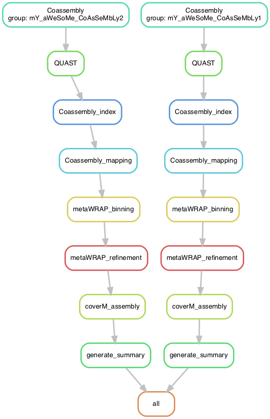
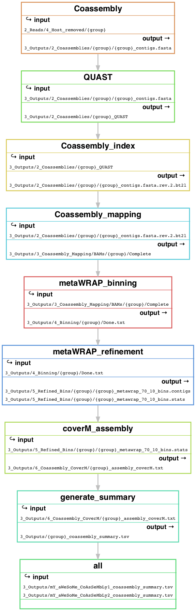
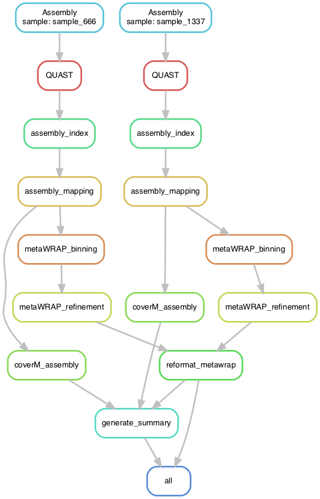
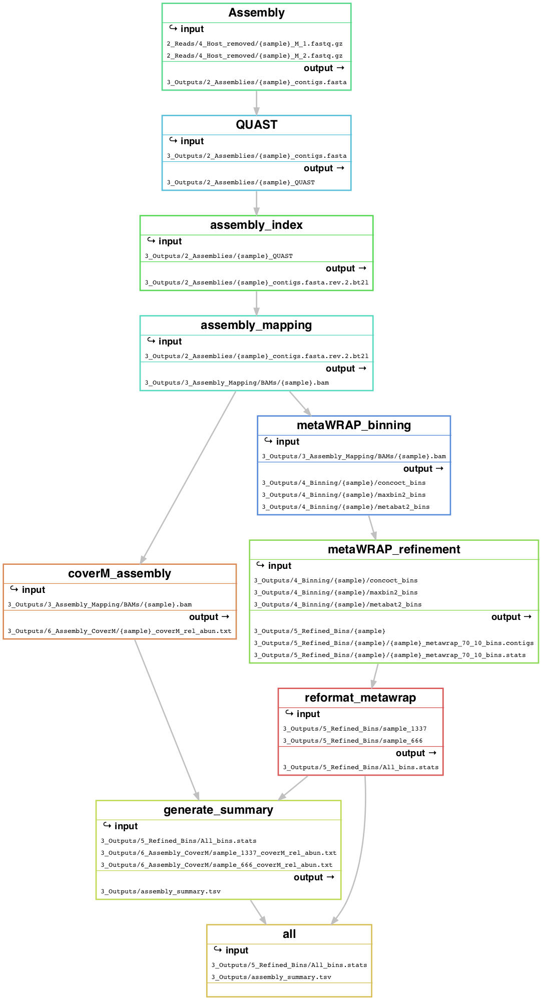

# EHI_Bioinformatics   🐨->💩->🦠->🧬->🖥️->😏
Bioinformatics pipeline to process EHI data.

*updated 24/11/2022, Raphael Eisenhofer*

#### General information:
This pipeline uses snakemake, and manages dependencies using conda (or mamba) for reproducibility and deployability. The 0_Code directory contains the snakefiles, scripts, and conda environment yamls. 

#### Getting started:
Firstly, you'll want to clone this directory to the system where you want to run the analyses:
```
git clone https://github.com/anttonalberdi/EHI_bioinformatics.git
```
#### Links to subsections
- [EHI_Bioinformatics](#ehi_bioinformatics)  
- [1_Preprocessing_pipeline](#1_preprocessing_pipeline)  
- [2_Assembly_binning_pipeline](#2_assembly_binning_pipeline)
  - [Coassembly_binning_pipeline](#coassembly_binning_pipeline)
  - [Individual_assembly_binning_pipeline](#individual_assembly_binning_pipeline)
- [3_Dereplication_annotation_pipeline](#3_Dereplication_annotation_pipeline)
  - [](#)
  - [](#)


# 1_Preprocessing_pipeline

### What this pipeline does:
This step of the pipeline quality filters (including adapter trimming, polyX tail removal) metagenomic reads using fastp (0.23.1). Host genomes are indexed using Bowtie2 (2.4.4), before the fastp-filtered reads being mapped to the host genome/s using BowTie2 (default settings). Nonpareil (3.4.1) is then run on the host-filtered reads to estimate metagenome diversity and assembly coverage. CoverM (0.6.1) is run on the host-mapped BAMs to calculate the read counts against the host genome/s. Finally, the summary statistics of the preprocessing and host mapping are collated into a final report.

Here is a simplified DAG (directed acyclic graph) of the above steps:


### 🔧 Configuration
The only thing that the user may wish to configure is the choice of adapter sequence that fastp uses to trim the raw reads. This can be adjusted by editing the [1_Preprocess_QC_config.yaml](0_Code/configs/1_Preprocess_QC_config.yaml) file. The default sequences are basic Illumina adapters that we use for the EHI (sequenced by NovoGene).

### ⚙️ Usage:
Currently, the snakefile searches for .fastq.gz files located in this path (assuming you are launching the snakefile from the current directory):
```
2_Reads/1_Untrimmed/*_1.fastq.gz
```
There are a couple of options for getting your data here:
- 1) Create symbolic links. This means you don't have to move or copy the files:
`ln -s reads_folder/*.fastq.gz 2_Reads/1_Untrimmed/`
- 2) You can just put the reads in this directory.

(note that the fastq file suffixes should be **'_1.fastq.gz'** and **'_2.fastq.gz'**).

Next, you'll need to do the same thing for your host reference genome/s, symbolic linking them or placing them in this folder:
```
1_References/
```
Note that the host reference genome/s need to be gzip compressed -- **'.gz'** suffix (default when downloading from NCBI). 

You need to have snakemake installed and in your path. You can do this either through conda, or use this module on Mjolnir:
```
module load snakemake/6.15.3
```

Before you run snakemake, make sure you're in a screen session. Screen creates a virtual session hosted by the remote server, and allows you to get back to where you left off in the event that your connection is lost (or your dog eats your laptop). Here's some basics to get you started:

Create a new screen session:
```
screen -S mY_c0oL_sCrEen
```
Reconnect to your screen session when you log back into the remote server:
```
screen -r mY_c0oL_sCrEen
```
(*Yes* you can have screens within screens, like Inception, but this is obviously not recommended!). For more information about screen, [use the internet](https://letmegooglethat.com/?q=how+to+use+screen+in+linux).

That's all the setup required to get the pipeline running. Now you just need to launch the snakefile using snakemake. How you do this depends on your HPC server job queueing system. For Mjolnir, I use the following:
```
snakemake \
-s 0_Code/1_Preprocess_QC.snakefile \
-j 20 \
--cluster "sbatch --mem {resources.mem_gb}G --time {resources.time} -c {threads} -v" \
--use-conda \
--conda-frontend conda \
--conda-prefix /projects/mjolnir1/people/ncl550/0_software \
--latency-wait 600
```

`snakemake -s 0_Code/1_Preprocess_QC.snakefile -j 20 --cluster "sbatch --mem {resources.mem_gb}G -c {threads} --time {resources.time} -v" --use-conda --conda-frontend conda --conda-prefix /projects/mjolnir1/people/ncl550/0_software --latency-wait 600`

I recommend adding the `--dry-run` or `-n` command to the above code initially, as this will let you figure out if everything is working as expected.

The `-j` flag controls how many concurrent jobs you wish snakemake to submit to SLURM. If you want to be nice to your fellow comrades, I would suggest keeping this below 30.

I've written the pipeline such that it handles the requesting of optimised resources (RAM/CPUs) for each job based on the specific snakemake rule. The `--conda-prefix` snakemake option tells snakemake to look for conda environment in a particular directory, which saves having to reinstall them each time you run from a new directory. 

### 💩 Outputs

The following directories are created in the `3_Outputs` folder:
- `2_Coassemblies` (where the coassemblies are stored, including QUAST outputs)

Here's a illustrative summary of each rule and it's input files and output files:


# 2_Assembly_binning_pipeline

Here lies your first major decision:


You take the **blue pill** (*coassembly*), the story ends, you wake up, believing that strain-level diversity doesn't exist.

You take the **red pill** (*individual assembly*), you stay in Wonderland, and I show you how deep the rabbit hole goes...

In all seriousness, from here you have a couple of options regarding your assembly and binning strategy. Generally, if you have deeply sequenced samples (>10 Gbp), use the [Individual_assembly_binning_pipeline](#individual_assembly_binning_pipeline). Otherwise, I would recommend the [Coassembly_binning_pipeline](#coassembly_binning_pipeline). Be careful not to coassemble samples that are too different from oneanother -- generally it's best to coassemble samples that come from the same individual or population/site.


# Coassembly_binning_pipeline

### What this pipeline does:
This pipeline merges reads from multiple samples and assembles them using either metaspades or megahit. The resulting assembly is then indexed (and a QUAST report created) and the preprocessed reads from the [1_Preprocessing_pipeline](#1_preprocessing_pipeline) are mapped to it using Bowtie2 (2.4.4). The output BAMs are then fed into the MetaWRAP binning and refinement modules. CoverM is then run on the BAMs to calculate the % of reads mapping to the coassemblies. Finally, a .tsv report is produced for your viewing pleasure.



### 🔧 Configuration
You can choose the assembler you want to use by adjusting the [2_Assembly_Binning_config.yaml](0_Code/configs/2_Assembly_Binning_config.yaml) file. You can also adjust the minimum contig size for binning (but do you think you should?). 

### ⚙️ Usage
To set up your coassemblies, you need to create a folder for each coassembly in the `2_Reads/4_Host_removed` folder, e.g.:
```
2_Reads/4_Host_removed/mY_aWeSoMe_CoAsSeMbLy1!!11!!!!
```
Again, you can either move the reads you wish to coassembly together into their respective folders, or use symbolic linking (to save disk space if you include the same sample in multiple coassemblies).

Once the files are ready, run the pipeline using the following code (SLURM job manager, Mjolnir):
```
snakemake \
-s 0_Code/2_Coassembly_Binning.snakefile \
-j 10 \
--cluster "sbatch --mem {resources.mem_gb}G --time {resources.time} -c {threads} -v" \
--use-conda \
--conda-frontend conda \
--conda-prefix /projects/mjolnir1/people/ncl550/0_software \
--latency-wait 600
```

`snakemake -s 0_Code/2_Coassembly_Binning.snakefile -j 10 --cluster "sbatch --mem {resources.mem_gb}G -c {threads} --time {resources.time} -v" --use-conda --conda-frontend conda --conda-prefix /projects/mjolnir1/people/ncl550/0_software --latency-wait 600`

If you wish, you can also add `--mail-type=end --mail-user=youremail@coolmail.com` to the `--cluster "sbatch ..."` call to get an email when the jobs are completed.

Again, I recommend adding the `--dry-run` or `-n` command to the above code initially, as this will let you figure out if everything is working as expected.

For `-j`, I would use a lower value here (not more than 10), as the rules in this pipeline are quite resource-hungry.

### 💩 Outputs

The following directories are created in the `3_Outputs/` folder:
- `2_Coassemblies/` (where the coassemblies are stored, including QUAST outputs)
- `3_Coassembly_Mapping/` (BAMs; I'd recommend deleting these after to save space, unless you think you need them)
- `4_Binning` (Empty, all bins are saved in 5_Refined_Bins)
- `5_Refined_Bins/` (contains MetaWRAP refined bins, and the original bins)
- `6_Coassembly_CoverM/` (CoverM outputs of BAMs)

Additionally, a report is created for you with some of the more juicier tidbits of information you'd like to see:
- `3_Outputs/<COASSEMBLY-NAME-PREFIX>_coassembly_summary.tsv`




# Individual_assembly_binning_pipeline

### What this pipeline does:
This uses the same software as the [Coassembly_binning_pipeline](#coassembly_binning_pipeline), but does assembly and binning on a per-sample basis instead. 



### 🔧 Configuration
Same options as in the [Coassembly_binning_pipeline](#coassembly_binning_pipeline).

### ⚙️ Usage
This is even easier to setup than the [Coassembly_binning_pipeline](#coassembly_binning_pipeline). The snakefile automatically uses any paired read files in the `2_Reads/4_Host_removed` (those created by the [1_Preprocessing_pipeline](#1_preprocessing_pipeline)). 

It's as simple as running the below code:
```
snakemake \
-s 0_Code/1_Preprocess_QC.snakefile \
-j 10 \
--cluster "sbatch --mem {resources.mem_gb}G --time {resources.time} -c {threads} -v" \
--use-conda \
--conda-frontend conda \
--conda-prefix /projects/mjolnir1/people/ncl550/0_software \
--latency-wait 600
```

`snakemake -s 0_Code/1_Preprocess_QC.snakefile -j 10 --cluster "sbatch --mem {resources.mem_gb}G -c {threads} --time {resources.time} -v" --use-conda --conda-frontend conda --conda-prefix /projects/mjolnir1/people/ncl550/0_software --latency-wait 600`

Again, I recommend adding the `--dry-run` or `-n` command to the above code initially, as this will let you figure out if everything is working as expected.

For `-j`, I would use a lower value here (not more than 10), as the rules in this pipeline are quite resource-hungry.

### 💩 Outputs

The following directories are created in the `3_Outputs/` folder:
- `2_Assemblies/` (where the coassemblies are stored, including QUAST outputs)
- `3_Assembly_Mapping/` (BAMs; I'd recommend deleting these after to save space, unless you think you need them)
- `4_Binning` (Empty, all bins are saved in 5_Refined_Bins)
- `5_Refined_Bins/` (contains MetaWRAP refined bins, and the original bins)
- `6_Assembly_CoverM/` (CoverM outputs of BAMs)

Additionally, a report is created for you with some of the more juicier tidbits of information you'd like to see:
- `3_Outputs/assembly_summary.tsv`



# 3_Dereplication_annotation_pipeline
TBD
