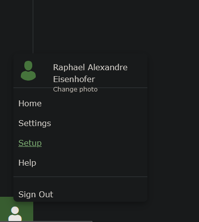
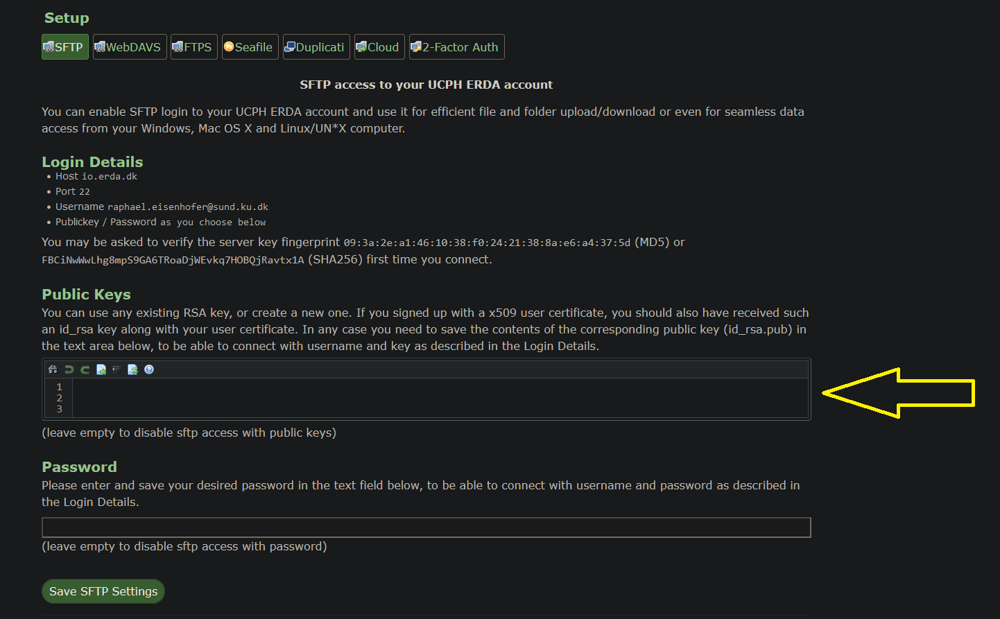

# EHI_Bioinformatics 
# 🐨->💩->🦠->🧬->🖥️->😏
Bioinformatics pipeline to process EHI data.

*updated 24/03/2023, Raphael Eisenhofer*

#### General information:
This pipeline uses [](https://snakemake.readthedocs.io), and manages dependencies using conda (or mamba) for reproducibility and deployability. The 0_Code directory contains the snakefiles, scripts, and conda environment yamls. 

#### Getting started:
Firstly, you'll need to set up an alias for connecting to ERDA -- this is **essential** for proper function.

If you haven't already, create a public ssh key:
```
ssh-keygen
```

This will prompt you with something like this:
```
Generating public/private rsa key pair.
Enter file in which to save the key (/home/ncl550/.ssh/id_rsa):
```

Press enter.

Now copy your public key (you'll need to change your path to match your user number):
```
more /home/ncl550/.ssh/id_rsa.pub
```

Copy the large string (e.g.)
```
ssh-rsa asd79as7d98as7d987as987d98a79d87a897d9a7d98a98d9 ncl550@mjolnirhead01fl.unicph.domain
```

Now, log into ERDA via your browser `https://erda.dk/wsgi-bin/home.py`

Navigate to your 'settings' in the bottom right corner:



And click the SFTP tab at the top:



You then want to paste your public SSH key into the box (see yellow arrow). Then click save.

Now, relog into mjolnir (or reload your shell if you know how to), and test the alias:
```
sftp erda
```

It may prompt you to allow the connection, if so, press enter.

Great, you can now launch the preprocessing pipeline via the 'PR_script' column in the 'PR BATCH' tab on AirTable (**Launch view**)! Note that you should select your email address in the 'Email' column to get alerted upon completion. 

Once the run is complete, you'll recieve an email. To input the preprocessing stats into AirTable, first download the file from here:
```
/projects/ehi/data/REP/PRBXXXX.tsv
```
Where XXXX is your PRB code.

You can then copy/paste the rows (not the header) into AirTable ('PR_Preprocessing' tab; 'Output' view). Remember to fiter by PRB, and double check to make sure the right data is going to the right rows.

Voila!
