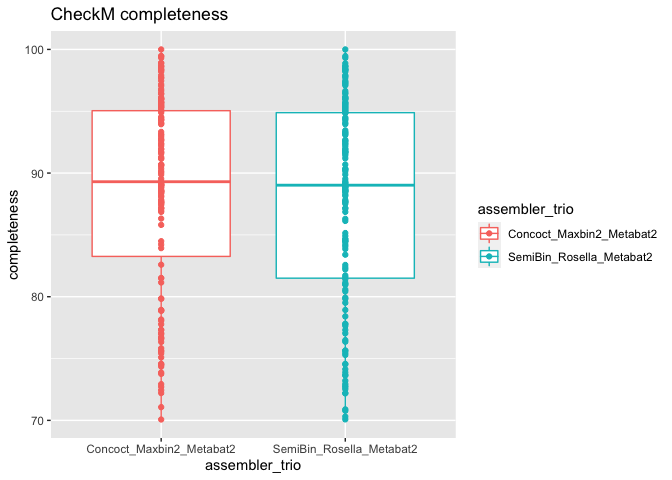
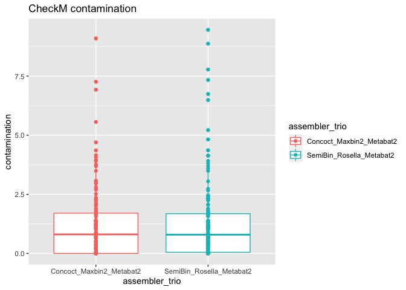
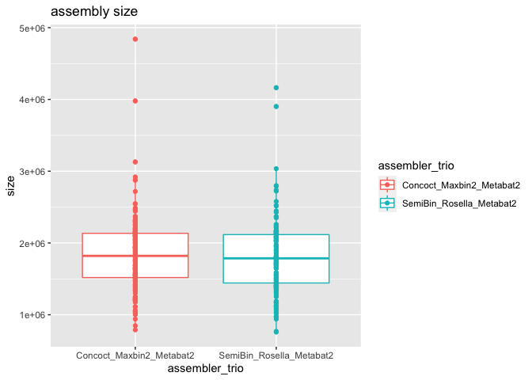
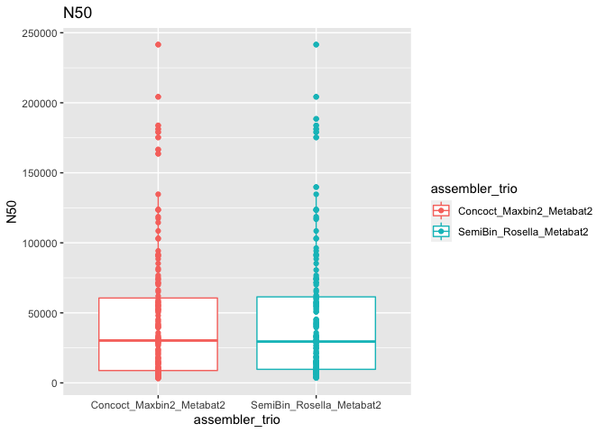
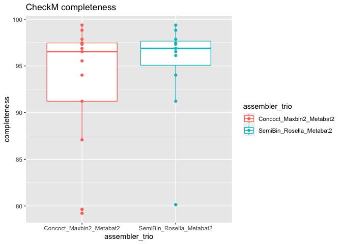
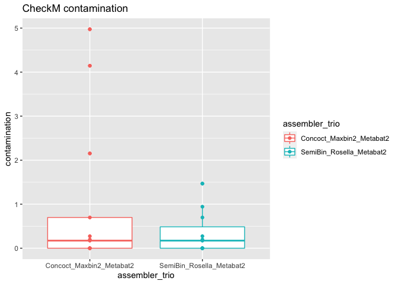
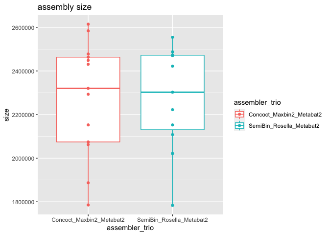
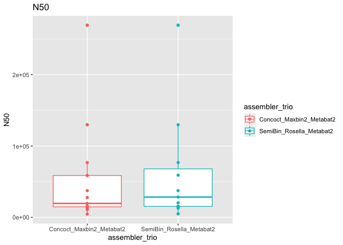

new_binner_comparison
================
Raphael Eisenhofer
2022-10-17

# Methods

#### Samples were individually assembled using MetaSpades and individually binned using our standard (CONCOCT, MaxBin2, MetaBat2) or new (Rosella, SemiBin, MetaBat2) binners.

# Deeply sequenced wombat faecal sample – high diversity

<!-- --><!-- --><!-- --><!-- -->

    ## [1] "mean number of contigs per bin for NEW_BINNERS"

    ## [1] 139.0065

    ## [1] "mean number of contigs per bin for STANDARD_BINNERS"

    ## [1] 164.7152

    ## [1] "NEW_BINNER trio gave 4 more bins over the STANDARD BINNERS"

# Deeply sequenced wombat pouch sample – low diversity

<!-- --><!-- --><!-- --><!-- -->

    ## [1] "mean number of contigs per bin for NEW_BINNERS"

    ## [1] 108

    ## [1] "mean number of contigs per bin for STANDARD_BINNERS"

    ## [1] 142.0769

    ## [1] "NEW_BINNER trio gave 0 more bins over the STANDARD BINNERS"

# Conclusion

#### There seems to be minor improvements in the number of bins obtained with the new binners for the diverse faecal sample. Bin qualities were improved for the low diversity pouch sample. A future comparison with coassemblies (or split-mode) would be intersting.
