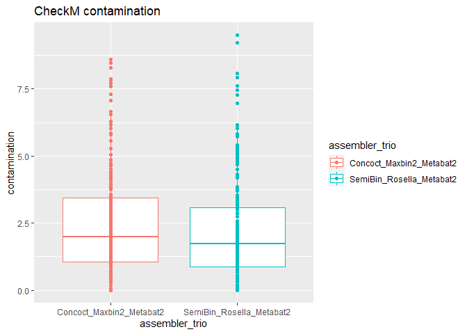
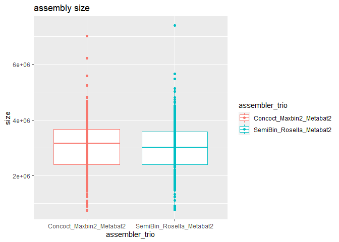
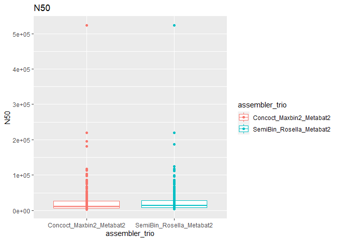
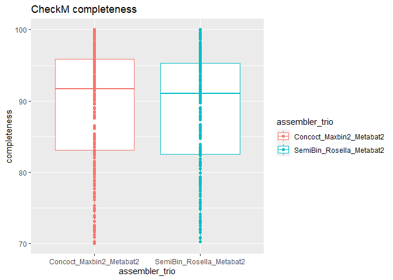
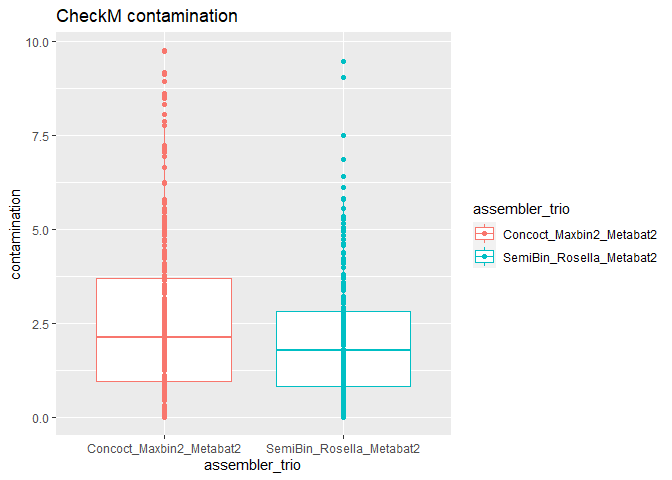
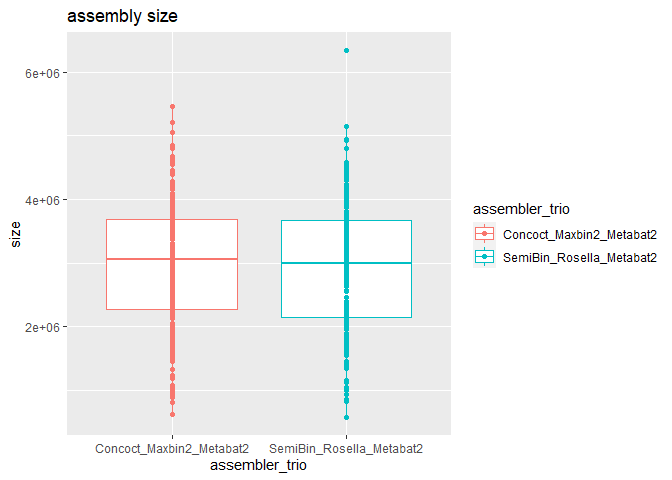
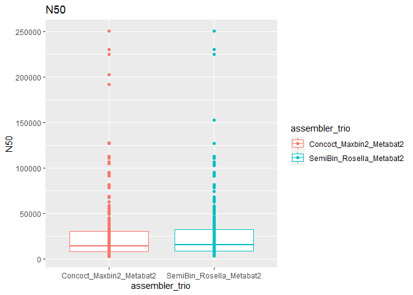
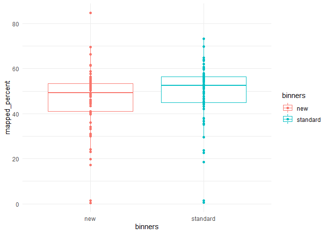

new_binner_comparison (coassembly)
================
Raphael Eisenhofer
2022-10-26

# Methods

#### Samples were coassembled using megahit and binned using our standard (CONCOCT, MaxBin2, MetaBat2) or new (Rosella, SemiBin, MetaBat2) binners.

# Podarcis muralis dataset (transect 1)

    ## Warning: package 'tidyverse' was built under R version 4.1.3

<!-- --><!-- --><!-- --><!-- -->
\

# Podarcis muralis dataset (transect 2)
<!-- --><!-- --><!-- --><!-- -->
\

# MAG catalogue mapping rates
<!-- -->

# Conclusion

The new binners had 17 fewer bins for coassembly transect 1.

The new binners had 17 fewer bins for coassembly transect 2.

The mapping rates for the new binners are not quite as good. I think
Rosella is seriously underperforming when looking at the metawrap
refinement figures.
